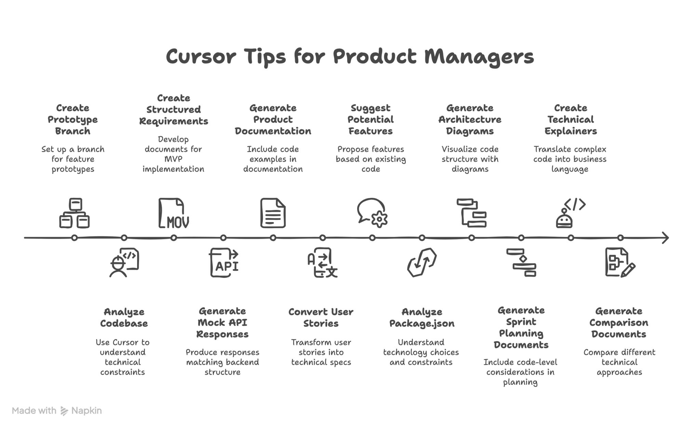

As a Product Manager, I'm always looking for ways to bridge the gap between product vision and technical execution. For a long time, this was a challenging task, especially when working with a lean engineering team. But recently, something truly transformative happened for my AI SaaS product: we started "vibe coding" in Cursor.

Working alongside my two brilliant engineers, Cursor has fundamentally changed how I approach product management. It's not just a coding environment; it's a collaborative intelligence that empowers me to be more technically informed and effective in my role.

I put some of my learnings into an inforgraphic – it includes some of the key ways Cursor has become an invaluable tool in my product management toolkit. From generating structured requirements and product documentation to analyzing our codebase and suggesting potential features based on existing code.

 Cursor helps me:
- Deeply understand technical constraints and possibilities.
- Generate precise mock API responses and technical specs from user stories.
- Visualize architecture, translating complex code into business language.
- Streamline sprint planning and comparison of technical approaches.

This shift has enabled us to move faster, build smarter, and ensure our product truly aligns with both user needs and technical feasibility. 

If you're a fellow Product Manager looking to level up your technical understanding and collaboration with engineering, I highly recommend exploring AI-powered coding environments like Cursor, Windsurf, Codex, Claude, MS Copilot etc. It's been a game-changer for us, and I believe it can be for you too.
